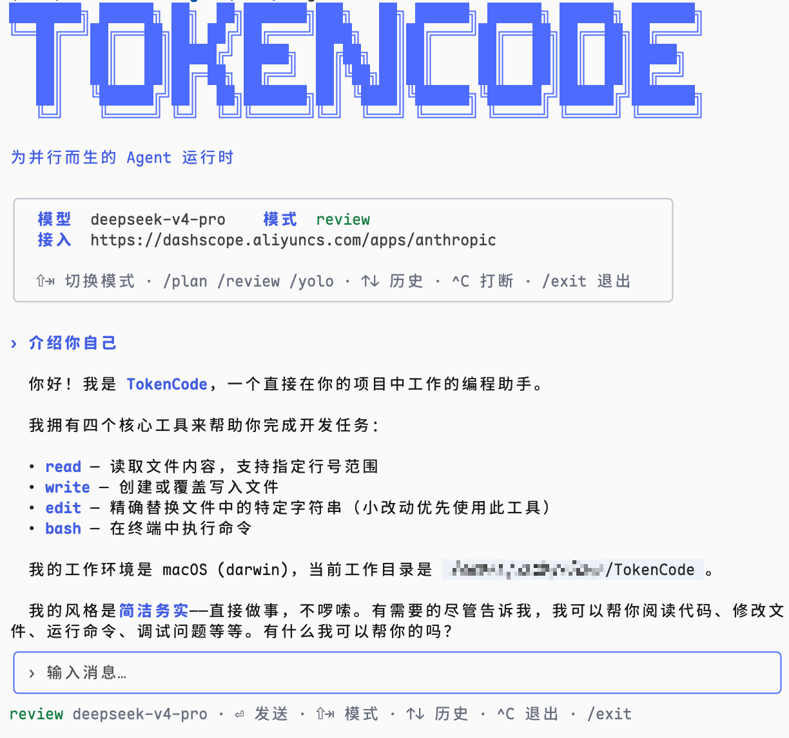

# TokenCode

> **为并行而生、对团队友好的 Agent 引擎。** 当前形态：一个 Go 终端编码 agent——单 agent 底座 + TUI 之上，已长出第一种并行模式 `/race`（最多 1000 个 agent 隔离竞赛解题、裁判择优）。方向：把编码 agent 从「个人终端工具」变成「团队基础设施」。路线见 [`ROADMAP.md`](ROADMAP.md)。



## 它是什么

一个跑在终端里的编码 agent：你说一句话，它用 `read` / `write` / `edit` / `bash` / `websearch` / `webfetch` 工具读改文件、跑命令、查资料，循环直到把活干完。流式输出、会话自动落盘（`-continue` 随时接着聊）、可委托子代理与 JS 工作流编排。核心是标准的 tool-use 循环：

```
用户消息 → LLM(带工具) → tool_use → 执行 → tool_result 回灌 → 循环 → 结束
```

- **走 Anthropic 协议**，默认通过 [DeepSeek](https://platform.deepseek.com/) 的 Anthropic 兼容端点接入，默认模型 `deepseek-v4-pro[1m]`。换 base URL 即可指向官方 Anthropic 或任何兼容服务。
- 单个静态二进制，开箱即用。

### `/race`：并行竞赛模式

```
/race 8 修复 internal/foo 的并发 bug，跑通全部测试
```

派 N 个 agent（N≤1000）**各自在隔离的 git worktree** 里独立解同一道题（文件工具被硬隔离在各自写空间），窗口化并发；跑完后裁判流水线择优——客观粗筛（空 diff / `race.check` 校验命令淘汰，零 token）→ 并行 LLM 打分 → top-4 决赛。排行榜出来后 `/race apply` 一键应用冠军改动（不自动 commit），冠军分支保留可追溯。

### 联网搜索

`websearch` 多后端自动回退：设置 `TAVILY_API_KEY` 时走 [Tavily](https://tavily.com)（LLM 友好摘录，免费档 1000 次/月），否则 DuckDuckGo → Mojeek 免 key 兜底——零配置可用，有配置更好。`webfetch` 抓网页转纯文本。

## 快速开始

```bash
export ANTHROPIC_BASE_URL=https://api.deepseek.com/anthropic
export ANTHROPIC_AUTH_TOKEN=<你的 DeepSeek API Key>
export ANTHROPIC_MODEL=deepseek-v4-pro[1m]

go run ./cmd/tokencode
# 或编译： go build -o bin/tokencode ./cmd/tokencode && ./bin/tokencode
```

进入后直接输入指令，例如 `create hello.txt containing hi, then read it back`。

权限四模式：**plan**（只读）/ **review**（逐次 y/n/a 确认，默认）/ **auto**（小模型按规则自动裁决）/ **yolo**（全放行）。
Shift+Tab 循环切换，或用 `/plan` `/review` `/auto` `/yolo`；`/exit` 或 Ctrl-D 退出，跑动中 Ctrl-C 打断当前轮。模式之上还可叠加声明式的[权限规则三表](#权限规则allow--ask--deny)（deny/ask/allow，团队治理用）。

输入 `/` 弹出命令补全菜单：`/help` 全部命令与快捷键、`/race` 并行竞赛、`/model` 查看与热切换模型、`/agents` 子代理类型（兼容 `.claude/agents`）、`/skills` 技能列表（`/技能名 [参数]` 调用，兼容 `.claude/skills`）、`/mcp` MCP server 状态与重连、`/usage`（别名 `/cost` `/stats`）本月与今日 token 用量统计（账本 JSONL 按月落在数据目录，WebUI 大盘同源）、`/context` 上下文用量（估算 tokens、消息占比、距自动压缩的余量）、`/compact [侧重点]` 把旧历史压缩成结构化摘要（保留最近 2 轮；估算超过 `compact.auto_threshold`（默认 80000，0=关闭）时 turn 前自动压缩）、`/rewind` 文件检查点回滚（见下）。`! <命令>` 直通 shell。

### `/rewind`：文件检查点回滚

`write`/`edit` 每次改文件前自动把原内容快照进 `.tokencode/checkpoints/`（影子文件 + JSONL manifest，按用户 turn 分组）。改坏了不用翻 git：

```
/rewind        # 列出本会话检查点（时间、工具、文件数）
/rewind 2      # 回滚到检查点 #2 拍下时的状态（该点及之后的改动按逆序撤销，新建文件删除）
/rewind clear  # 清空本会话检查点
```

边界写清楚：**只回滚文件，不回滚对话历史**（模型仍记得后面的事，必要时配合 `/compact`）；**bash 命令造成的改动拦不到**（已知盲区，bash 是任意进程，没有写盘前拦截点）；`/race` racer 在各自 worktree 里跑，不触发主仓库检查点。检查点退出不删（留着翻旧账），7 天前的旧会话目录启动时自动清理。

### 常用 flag

| flag | 默认 | 说明 |
|------|------|------|
| `-model` | `$ANTHROPIC_MODEL` 或 `deepseek-v4-pro[1m]` | 模型 id |
| `-base-url` | `$ANTHROPIC_BASE_URL` 或 `https://api.deepseek.com/anthropic` | Anthropic 协议端点 |
| `-max-tokens` | `4096` | 单次最大输出 token |
| `-yolo` | `false` | 初始进入 yolo 模式（跳过写/改/执行确认） |
| `-theme` | `auto` | 配色主题：`auto` / `light` / `dark` |
| `-continue` | `false` | 继续当前目录最近一次会话 |
| `-resume` | — | 按会话 id 恢复 |
| `-no-session` | `false` | 本次会话不落盘 |
| `-w` | — | 在隔离 git worktree 里干活：`<repo>/.tokencode/worktrees/<name>`（分支 `tokencode/wt-<name>`，基于 HEAD；同名复用；非 git 仓库报错）。退出**不**自动删，验收后手动 `git worktree remove` 清理；状态栏显示 `wt:<name>` 标记 |
| `-p` | — | headless：跑一个 turn 后退出（`-p "任务"`，或管道 `echo 任务 \| tokencode -p`） |
| `-output` | `text` | headless 输出格式：`text` / `json` / `stream-json`（JSONL 事件流，仅 `-p` 下有效） |
| `-allowed-tools` | `read,websearch,webfetch` | headless 工具白名单（逗号分隔）；白名单外直接拒绝，`-yolo` 全放行 |

### Headless 与 HTTP API

无人值守的两种用法，权限语义相同（白名单外的工具调用直接拒绝、喂回模型）：

```bash
# headless：脚本/CI 里跑一个 turn 即退出（成功 0、出错 1）
tokencode -p "总结 README 的核心卖点" -output json
git diff | tokencode -p -allowed-tools read   # 管道喂 prompt

# HTTP API（v0 无鉴权，默认只绑回环）
tokencode serve -addr 127.0.0.1:8787
curl -s http://127.0.0.1:8787/v1/run -d '{"prompt":"列出当前目录结构","model":"可选"}'
# SSE 流式（事件与 -output stream-json 同构，最后一条恒为 result）
curl -N -H 'Accept: text/event-stream' http://127.0.0.1:8787/v1/run -d '{"prompt":"..."}'
```

每个请求独立 agent 实例（无共享历史），`-max-concurrent`（默认 8）限制同时在跑的 run。

#### WebUI（serve 自带）

`tokencode serve` 起来后浏览器开 **http://127.0.0.1:8787/ui** 即是自带管理界面——纯 html/template + 原生 JS，go:embed 进单二进制，零前端框架、零 CDN（内网可用）：

- **/ui · 用量大盘**：本月与今天的 in/out/cache 合计与调用次数、近 30 天按天条形图（纯 CSS）、本月按模型/按来源 Top 10；数据来自 `GET /api/usage?from=&to=`（日期含 to 当天），与 `/usage` 命令同一本账。
- **/ui/chat · 聊天**：textarea 发 `POST /v1/run` 的 SSE 流式渲染（工具调用折叠显示），可指定 model——单 turn、无共享历史，语义同 headless `-p`。
- **/ui/team · 团队管理**：绑定列表与待认领配对码；页面上直接生成配对码（`POST /api/team/pair`）与解绑（`DELETE /api/team/binding`），与 `tokencode team` 共用同一份 team.json。
- **/ui/models · 模型目录**：内置 catalog 全部 provider 与凭据状态（✓ env / ✓ auth.json / —），只读。

安全边界与 serve 相同：**v0 无鉴权，默认仅绑回环，勿绑 0.0.0.0**（页面顶部常驻提示）。`/api/*` 的写操作额外要求回环来源 + 本机 Host（防 DNS rebinding）。

<!-- TODO: WebUI 大盘截图 -->


### 团队模式（IM 接入，飞书/钉钉）

团队每个成员用自己的飞书/钉钉账号远程驱动**自己的工作空间**：单聊机器人发消息 → agent 在绑定的目录里跑一个 turn → 回最终结果。长连接接入，**免公网 IP**；文件工具被硬隔离在各自工作空间之内。

**1. 建飞书自建应用**（[open.feishu.cn](https://open.feishu.cn) 开发者后台 → 创建企业自建应用）：

- 「添加应用能力」开启**机器人**；
- 「权限管理」开通读取与发送单聊消息权限（`im:message` 一组）；
- 「事件与回调」订阅方式选**长连接**，订阅事件 `im.message.receive_v1`（接收消息）；
- 发布版本，把 App ID / App Secret 写进 `~/.config/tokencode/config.json`：

```json
{
  "channels": {
    "feishu": { "app_id": "cli_xxx", "app_secret": "xxx" }
  }
}
```

**钉钉**同理（[open.dingtalk.com](https://open.dingtalk.com) 开发者后台 → 创建企业内部应用）：「添加应用能力」加**机器人**，消息接收模式选 **Stream 模式**，发布后把应用凭证页的 Client ID / Client Secret 写进 config：

```json
{
  "channels": {
    "dingtalk": { "client_id": "dingxxx", "client_secret": "xxx" }
  }
}
```

**2. 起服务并配对成员**：

```bash
tokencode serve                                                # config 配了 channels 即自动连飞书/钉钉
tokencode team pair -workspace ~/work/proj-a -name 小明        # 生成 8 位配对码
tokencode team pair -workspace ~/work/proj-b -tools read,bash  # 可配工具白名单 / -model / -yolo
```

成员在 IM 里把配对码发给机器人即绑定成功（码 1 小时有效、单次有效，绑定存 `team.json`，0600）；之后直接发消息就是在自己的工作空间里驱动 agent。`tokencode team list` 看绑定与待认领码，`tokencode team remove <channel> <user_id>` 解绑。

默认工具白名单是只读集（`read,websearch,webfetch`）；`-tools` 放开写类工具、`-yolo` 全放行（信任成员才开）。每成员会话历史常驻 serve 进程内存（重启清零）；v0 只处理单聊文本，卡片流式/审批按钮/群聊后置。

#### 微信接入（实验性）

走腾讯官方 **iLink Bot API**（ClawBot 背后的 HTTP 协议，纯 Go、免浏览器/Windows 宿主）。成员各自扫码、各得一个独立 bot 账号：

```bash
tokencode wechat login    # 终端出二维码，手机微信扫码确认即落盘凭证（0600）
tokencode wechat list     # 已登录账号；logout <account_id> 移除
```

config 里显式开启通道（`"channels": {"wechat": {"enabled": true}}`，`base_url` 可覆盖基座），`tokencode serve` 即自动拉起长轮询；配对绑定工作空间与飞书同一套（`team pair` 发码）。**注意限制**：扫码连上的是独立 iLink bot 身份（`xxx@im.bot`），不是你的微信本身——**只支持私聊 DM**，队友要私聊这个 bot 而不是扫码者；协议处于灰度期、无正式公开文档，token 会过期需重扫（serve 日志会提示），字段与限频策略可能随腾讯调整而变。

### 模型与国内 Coding Plan 开箱即用

内置 [models.dev](https://models.dev) 目录快照（141 个 provider），**Kimi for Coding、智谱 GLM Coding Plan、阿里百炼 Coding Plan、MiniMax、DeepSeek、腾讯混元**等国内模型与包月套餐无需写任何配置：

```bash
tokencode models coding              # 浏览目录（按关键词过滤）
tokencode auth login kimi-for-coding # 粘贴 key，存入 auth.json（0600）
tokencode -model kimi-for-coding/k2p6
```

key 也可走环境变量（如 `KIMI_API_KEY`、`ZHIPU_API_KEY`，目录里每个条目都声明了探测变量）。目录快照用 `scripts/update-catalog.sh` 更新，`TOKENCODE_CATALOG` 可指向私有镜像。

### 手工注册 provider（config.json）

不写 config 时行为与上面完全一致（ANTHROPIC_* 环境变量 + DeepSeek 端点）。要精确控制端点/协议，在 `~/.config/tokencode/config.json`（或 `$XDG_CONFIG_HOME/tokencode/config.json`）注册 provider（同名条目压过内置目录）：

```json
{
  "providers": {
    "deepseek": {
      "base_url": "https://api.deepseek.com/anthropic",
      "protocol": "anthropic",
      "api_key_env": "DEEPSEEK_API_KEY",
      "auth": "bearer"
    },
    "kimi": {
      "base_url": "https://api.moonshot.cn/v1",
      "protocol": "openai",
      "api_key_env": "MOONSHOT_API_KEY"
    },
    "ollama": {
      "base_url": "http://localhost:11434/v1",
      "protocol": "openai"
    },
    "gemini": {
      "protocol": "google",
      "api_key_env": "GEMINI_API_KEY"
    }
  },
  "models": {
    "ds": "deepseek/deepseek-v4-pro[1m]",
    "local": "ollama/qwen3",
    "g": "gemini/gemini-2.5-pro"
  },
  "default_model": "ds"
}
```

- `protocol` 按协议命名，目前三种：`anthropic`、`openai`（Chat Completions，DeepSeek/Kimi/Qwen/OpenRouter/Ollama 通用，换 `base_url` 即可零代码接入）、`google`（Gemini，`base_url` 缺省指向官方端点）。旧值 `openai-chat` 仍兼容，等同 `openai`。
- key 推荐用 `api_key_env` 指向环境变量；本地 Ollama 不需要 key。
- 用法：`tokencode -model local`（别名）或 `tokencode -model ollama/llama3`（`provider/model-id`）。两者都不中时 `-model` 原样直传默认端点，兼容老用法。

### 权限规则（allow / ask / deny）

四模式之上可叠加声明式规则三表，写在 config.json 的 `permissions` 字段（全局）或项目的 `.tokencode/permissions.json`（与全局合并取并集，结构相同）：

```json
{
  "permissions": {
    "allow": ["read", "bash(git log *)", "bash(go test*)", "agent(explore)", "mcp__github__*"],
    "ask":   ["bash(git push *)", "write(*.env)"],
    "deny":  ["bash(rm -rf *)", "read(*secrets*)"]
  }
}
```

规则语法是 `工具名` 或 `工具名(参数模式)`，参数模式按工具取义：

- **bash**：对 command 做 glob（`*` 匹配任意字符序列，大小写敏感）；尾部 ` *` 允许零参数——`bash(git log *)` 同时命中 `git log -5` 与 `git log`。复合命令（`a && b`、`a; b`、管道）拆段逐判：**任一段命中 deny 即 deny，全部段命中 allow 才 allow**；含命令替换（`$(…)`/反引号）的段永不命中 allow。
- **read / write / edit**：对 path 做同一套 glob，`*` 跨路径分隔符（天然含 `**` 语义），按工具收到的原样路径匹配。
- **agent**：对 `subagent_type` 做 glob；**工具名本身也支持 glob 且忽略大小写**（`mcp__github__*` 命中该 server 全部工具）。其余工具（websearch、mcp 等）只认裸工具名规则。

与四模式的关系——优先级从高到低：**deny 规则 > plan 只读铁律 > ask 规则 > allow 规则 > 模式默认**。deny 在所有入口全局生效（TUI、headless `-p`、serve、IM 通道，yolo 也拦）；ask 强制人工确认（yolo/auto 下也要问）；allow 跳过确认直接放行（但突破不了 plan 的只读、也不影响 headless 的显式白名单语义）；三表都不命中才走模式默认逻辑。坏规则启动时警告并跳过，不阻塞。

两个 permissions 文件分工：`.tokencode/permissions.json` 是给规则引擎的**硬规则**（确定性匹配，本节语法）；`.tokencode/permissions.md` 是给 auto 模式小模型裁决器的**自然语言规则**（软提示，仅 auto 模式生效）。两者并存：硬规则先判，不命中再轮到模式逻辑（auto 模式才咨询小模型）。
### Hooks

Claude Code 风格的命令型 hooks 子集——四事件：`PreToolUse`（工具执行前，可阻断）、`PostToolUse`（工具执行后）、`SessionStart`（装配完成、会话开始）、`Stop`（一个 turn 正常收口）。配置写在 config.json 顶层 `"hooks"`（全局）或项目的 `.tokencode/hooks.json`（两边合并，同事件下项目 hook 先执行）：

```json
{
  "PreToolUse":  [{"matcher": "bash", "command": "my-guard.sh"}],
  "PostToolUse": [{"matcher": "write|edit", "command": "gofmt -w \"$TOKENCODE_FILE\" 2>/dev/null || true"}],
  "SessionStart": [{"command": "echo '{\"systemMessage\":\"记得先跑 go test\"}'"}],
  "Stop": [{"command": "notify-send TokenCode done"}]
}
```

- `matcher` 是对工具名的整名正则（空=全匹配），仅 Pre/PostToolUse 有。
- 命令经 `sh -c` 执行，stdin 喂 JSON 事件载荷：`{"event":"PreToolUse","tool":"bash","input":{...},"cwd":"..."}`（PostToolUse 多 `result` 前 2000 字符与 `is_error`）；env 给便捷字段 `TOKENCODE_EVENT` / `TOKENCODE_TOOL` / `TOKENCODE_FILE`（write/edit/read 的 path 参数，有就给）。
- **退出码协议**：PreToolUse 下 `exit 2` 阻断该次工具调用，stderr 作为给模型的拒绝理由（`blocked by PreToolUse hook: ...`）；其余非零退出码只警告不阻断。stdout 若是 `{"systemMessage":"..."}` JSON，内容作为提示展示给用户。单 hook 超时 30s，超时按非阻断处理。
- TUI / headless `-p` / `serve` / IM 通道全路径生效；没配置任何 hook 时零开销。

### Go SDK

`pkg/tokencode` 是嵌入式门面：`go get github.com/yzfly/tokencode` 后十行代码在自己的 Go 程序里起一个 agent，执行与事件语义与 `tokencode -p` 完全一致（同一套 internal 实现，只包一层稳定 API）。

```go
import "github.com/yzfly/tokencode/pkg/tokencode"

tc, err := tokencode.New(
    tokencode.WithModel("kimi-for-coding/k2p6"),   // 经 config + 内置目录解析；不设走默认链
    tokencode.WithTools(tokencode.DefaultTools()), // read/write/edit/bash/websearch/webfetch
    tokencode.WithAllowedTools("read", "bash"),    // 白名单（缺省全放行，SDK 用户自己负责）
    tokencode.WithRoot(dir),                       // 文件工具根隔离 + bash 工作目录
)
out, err := tc.Run(ctx, "fix the bug") // 单 turn 返回最终文本；连续 Run = 多轮对话
err = tc.RunStream(ctx, "...", func(ev tokencode.Event) { /* 事件流，最后一条恒为 result */ })
```

API 面：`New` + Option（`WithModel` / `WithLLM`（注入自定义模型客户端）/ `WithTools` / `WithAllowedTools` / `WithRoot` / `WithMaxTokens` / `WithSystemPrompt` / `WithUsageSource`）；`Client.Run` / `RunStream` / `AddTool` / `History` / `Reset` / `Model`。`Tool`、`LLM`、`Event`、`Request/Response/Message` 等核心类型经 type alias 原样导出——自定义工具与自定义 LLM 都不需要（也不能）import internal。缺凭据时报错自带 `tokencode auth login` 指引。可跑的最小示例见 [`examples/sdk`](examples/sdk/main.go)（默认 fake 模型离线演示完整 tool-use 回路）。

## 开发

```bash
go test ./...     # 全部单测（工具层 / agent 循环 / LLM 协议层 httptest / SDK 门面）
go vet ./...
```

## 路线

- [x] 单 agent tool-use 循环（MVP 底座）
- [x] streaming、会话持久化（`-continue`/`-resume`）、多 provider（anthropic/openai/google 三协议）
- [x] 子代理（agent 工具）+ 动态工作流（workflow JS 编排）+ 联网搜索（Tavily/DDG/Mojeek）
- [x] A · 横向爆破（竞赛）v1：`/race` 派 N 个、worktree 隔离、裁判择优 ——*打磨中：败者提前退钱、投票裁判、预算建模*
- [x] 模型与国内 coding plan 开箱即用（内置 models.dev 目录 + `tokencode auth login`）
- [ ] 团队接入：IM 通道体系（飞书/钉钉长连接 → 微信扫码/企微），每成员独立工作空间
- [ ] SDK/CLI 可编程化与 WebUI 用量大盘 ——*headless `-p`、`serve`、Go SDK（`pkg/tokencode`）已落地，余 WebUI*
- [ ] 工作区权威（单写者）+ 三方合并：B · 协作模式的并行写

## 参与 / 了解进展

TokenCode 想做成一个「一起来做 Agent」的开源项目——除了代码，每天的开发过程、当前状态和整张路线图都公开，供后来者学习或接力：

- [`devlog/`](devlog/) —— 开发日记，按天记录「今天做了什么 / 是什么状态 / 为什么这么选」。
- [`ROADMAP.md`](ROADMAP.md) —— 从内核推导的整张路线图，分阶段并标注当前状态。
- [`STATUS.md`](STATUS.md) —— Agent 当前状态快照，5 分钟看懂「现在是什么、到哪一步了」。

## 作者与许可

- 作者：云中江树（微信公众号：云中江树）
- 许可：[CC BY-NC 4.0](LICENSE)（非商用）
